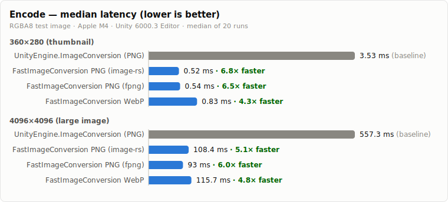
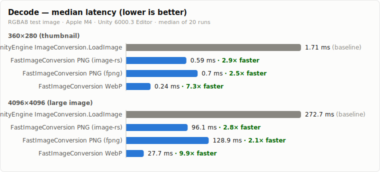

# FastImageConversion

English | [日本語](./README.ja.md)

Fast image encoding / decoding plugins for Unity, implemented as thin native libraries.

Unlike `UnityEngine.ImageConversion`, every API is callable **from any thread** (not just the Unity main thread), and both encoding and decoding are considerably faster.

## Features

|                | Encode             | Decode |
|----------------|--------------------|--------|
| WebP           | :white_check_mark: | :white_check_mark: |
| PNG (image-rs) | :white_check_mark: | :white_check_mark: |
| PNG (fpng)     | :white_check_mark: | :white_check_mark: (fpng-encoded files only) |
| JPEG           | :x:                | :x: |

- **Off-main-thread**: no dependency on the Unity main thread. Encode/decode from worker threads or your own job code
- **Two PNG implementations to choose from**:
    - [image-rs/png](https://github.com/image-rs/image-png) — pure Rust, general-purpose decoder/encoder
    - [fpng](https://github.com/richgel999/fpng) — very fast SSE-optimized C++ encoder. Its decoder only reads PNGs produced by fpng itself; fall back to the image-rs decoder for arbitrary PNGs
- **WebP** — libwebp build tuned for encoding speed. Lossy and lossless are both supported
- **Zero-copy results** — encoded/decoded results live in native memory and are exposed as `NativeArray<byte>` views; ownership is managed by `SafeHandle`

## Performance

Median of 20 runs on RGBA8 synthetic photo-like test images, Apple M4, inside the Unity 6000.3 Editor.
Measured with [Unity Performance Testing](https://docs.unity3d.com/Packages/com.unity.test-framework.performance@3.1/manual/index.html) at 360x280 / 1024x1024 / 2048x2048 / 4096x4096 — see `Assets/Tests/ImageConversionPerformanceTests.cs` to reproduce. Two representative sizes are shown below; encode is roughly 5-7x faster and WebP decode up to ~10x faster than `UnityEngine.ImageConversion` across all measured sizes.

### Encode

vs `UnityEngine.ImageConversion.EncodeNativeArrayToPNG`:

<picture>
  <source media="(prefers-color-scheme: dark)" srcset="docs/images/benchmark_encode_dark.svg">
  
</picture>

<details>
<summary>Raw numbers (including encoded sizes)</summary>

**360x280 (thumbnail)**

|                                     | latency (median) | vs UnityEngine | encoded size |
|-------------------------------------|-----------------|----------------|--------------|
| UnityEngine.ImageConversion (PNG)   | 3.53 ms         | 1.0x (baseline) | 152,839 B    |
| FastImageConversion PNG (image-rs)  | **0.52 ms**     | **6.8x faster** | 228,182 B    |
| FastImageConversion PNG (fpng)      | **0.54 ms**     | **6.5x faster** | 246,197 B    |
| FastImageConversion WebP (lossy, default config) | **0.83 ms** | **4.3x faster** | 4,360 B |

**4096x4096 (large image)**

|                                     | latency (median) | vs UnityEngine | encoded size |
|-------------------------------------|-----------------|----------------|--------------|
| UnityEngine.ImageConversion (PNG)   | 557.3 ms        | 1.0x (baseline) | 19,935,689 B |
| FastImageConversion PNG (image-rs)  | **108.4 ms**    | **5.1x faster** | 37,606,042 B |
| FastImageConversion PNG (fpng)      | **93.0 ms**     | **6.0x faster** | 40,360,776 B |
| FastImageConversion WebP (lossy, default config) | **115.7 ms** | **4.8x faster** | 225,230 B |

</details>

### Decode

vs `UnityEngine.ImageConversion.LoadImage`:

<picture>
  <source media="(prefers-color-scheme: dark)" srcset="docs/images/benchmark_decode_dark.svg">
  
</picture>

<details>
<summary>Raw numbers</summary>

**360x280 (thumbnail)**

|                                     | latency (median) | vs UnityEngine |
|-------------------------------------|-----------------|----------------|
| UnityEngine ImageConversion.LoadImage (PNG) | 1.71 ms | 1.0x (baseline) |
| FastImageConversion PNG (image-rs)  | **0.59 ms**     | **2.9x faster** |
| FastImageConversion PNG (fpng)      | **0.70 ms**     | **2.5x faster** |
| FastImageConversion WebP            | **0.24 ms**     | **7.3x faster** |

**4096x4096 (large image)**

|                                     | latency (median) | vs UnityEngine |
|-------------------------------------|-----------------|----------------|
| UnityEngine ImageConversion.LoadImage (PNG) | 272.7 ms | 1.0x (baseline) |
| FastImageConversion PNG (image-rs)  | **96.1 ms**     | **2.8x faster** |
| FastImageConversion PNG (fpng)      | **128.9 ms**    | **2.1x faster** |
| FastImageConversion WebP            | **27.7 ms**     | **9.9x faster** |

</details>

Notes:

- The PNG encoders are configured for **speed over compression ratio** (fastest compression level), so their output is larger than Unity's default PNG output. If output size matters, WebP is dramatically smaller at comparable speed
- `ImageConversion.LoadImage` also uploads the result to a `Texture2D`, so the decode comparison is not strictly apples-to-apples — but it is the API you would otherwise use

## Supported platforms

Prebuilt binaries are included for:

| Plugin | linux-x64 | windows-x64 | macOS-arm64 | iOS-arm64 | Android-arm64 |
|--------|-----------|-------------|-------------|-----------|---------------|
| PNG (image-rs) | :white_check_mark: | :white_check_mark: | :white_check_mark: | :white_check_mark: | :white_check_mark: |
| WebP   | :white_check_mark: | :white_check_mark: | :white_check_mark: | :white_check_mark: | :white_check_mark: |
| PNG (fpng) | :white_check_mark: | :white_check_mark: | :white_check_mark: | :white_check_mark: | :x: |

Other targets can be produced from source (see [Building](#building-from-source)).

## Installation

Add the packages you need via UPM (git URL). `FastImageConversion.Core` is required by all codec packages:

```
https://github.com/POPOPOinc/FastImageConversion.git?path=FastImageConversion.Unity/Packages/FastImageConversion.Core
https://github.com/POPOPOinc/FastImageConversion.git?path=FastImageConversion.Unity/Packages/FastImageConversion.Png
https://github.com/POPOPOinc/FastImageConversion.git?path=FastImageConversion.Unity/Packages/FastImageConversion.FPng
https://github.com/POPOPOinc/FastImageConversion.git?path=FastImageConversion.Unity/Packages/FastImageConversion.Webp
```

## Usage

### Pixel format

The native plugins take pixel data as consecutive 4-byte RGBA pixels:

```
RGBARGBARGBA...
```

- 1 byte per channel (0-255)
- The origin is expected to be **top-left**, following common image library conventions

This is almost identical to Unity's `GraphicsFormat.R8G8B8A8_UNorm`, but Unity textures have their origin at the **bottom-left**, so a vertical flip is needed in between. The Texture2D helpers (`EncodeTexture` / `DecodeToTexture` / `ToTexture2D`) handle this automatically; for the low-level APIs, `PixelUtility` provides the conversions:

```csharp
using FastImageConversion;

// Readable Texture2D -> RGBA8 pixels with a top-left origin (flip included)
using var pixels = PixelUtility.GetPixelsTopLeft(texture, Allocator.Temp);

// or flip an existing RGBA8 buffer in place
PixelUtility.FlipVertically(pixels, width, height);
```

### Encode

The simplest form — encode a readable `Texture2D` (flip handled internally, main thread only):

```csharp
using FastImageConversion;

File.WriteAllBytes(path, FPng.EncodeTexture(texture));         // PNG (fpng)
File.WriteAllBytes(path, Png.EncodeTexture(texture));          // PNG (image-rs)
File.WriteAllBytes(path, WebP.EncodeTexture(texture));         // WebP
```

Note that `EncodeTexture` returns a managed `byte[]` for convenience — it allocates GC memory.

The low-level APIs take RGBA8 pixels (`ReadOnlySpan<byte>` or `NativeArray<byte>`, top-left origin) and are callable from any thread. The encoded result stays in native memory, so writing it out through `AsSpan()` allocates **no managed memory at all**:

```csharp
// PNG — zero-copy write to a file
using (var encoded = FPng.Encode(pixels, width, height))
using (var file = File.OpenWrite(path))
{
    file.Write(encoded.AsSpan());
}

// WebP with an explicit config
var config = WebP.CreateConfig(WebPPreset.Picture, qualityFactor: 75f);
// also: WebP.CreateFastConfig() (default) / WebP.CreateLosslessConfig()
using (var encoded = WebP.Encode(pixels, width, height, config))
using (var file = File.OpenWrite(path))
{
    file.Write(encoded.AsSpan());
}
```

The result handles own native memory; disposing them (e.g. with `using`) frees it.
`AsNativeArray()` / `AsSpan()` are zero-copy views into that memory, valid until the handle is disposed.
`ToArray()` copies the bytes into a new managed array (GC allocation) — use it only when a `byte[]` is actually required.

### Decode

The simplest form — decode into a `Texture2D` (flip handled internally, main thread only):

```csharp
Texture2D texture = Png.DecodeToTexture(pngBytes);
Texture2D texture = WebP.DecodeToTexture(webpBytes);
```

The low-level APIs produce RGBA8 (`GraphicsFormat.R8G8B8A8_UNorm` compatible) pixel data with a top-left origin, callable from any thread:

```csharp
using (var decoded = Png.Decode(pngBytes))
{
    var width = decoded.Width;
    var height = decoded.Height;
    NativeArray<byte> rgba = decoded.AsNativeArray(); // zero-copy view

    // on the main thread, decoded.ToTexture2D() creates a Texture2D (flip included)
}

// Header-only peek without decoding pixels
PngMeta pngMeta = Png.Info(pngBytes);   // Width / Height
WebPMeta webpMeta = WebP.Info(webpBytes); // Width / Height / HasAlpha / Format
```

The fpng decoder only reads PNGs encoded by fpng itself. Use `TryDecode` to fall back to the general-purpose decoder:

```csharp
if (!FPng.TryDecode(bytes, out var decoded))
{
    decoded = Png.Decode(bytes); // not written by fpng — use the general-purpose decoder
}
using (decoded)
{
    // ...
}
```

## Project structure

```
.
├── FastImageConversion.Unity     # Unity project hosting the packages and tests
│   ├── Packages
│   │   ├── FastImageConversion.Core   # shared helpers (PixelUtility, handle bases)
│   │   ├── FastImageConversion.Png    # image-rs based PNG encoder/decoder
│   │   ├── FastImageConversion.FPng   # fpng based PNG encoder/decoder
│   │   └── FastImageConversion.Webp   # libwebp based WebP encoder/decoder
│   └── Assets/Tests              # correctness + performance tests
└── fast_image_conversion_native  # Rust workspace producing the native plugins
    ├── fic_png                   # image-rs wrapper
    ├── fic_fpng                  # fpng (C++, git submodule) wrapper
    ├── fic_webp                  # libwebp wrapper
    └── cli                       # small CLI for local testing
```

Each native plugin is built with the Rust toolchain. C# bindings (`NativeMethods.g.cs`) are generated at build time by [csbindgen](https://github.com/Cysharp/csbindgen).

## Building from source

fpng is referenced as a git submodule — clone with `--recursive`, or run:

```bash
git submodule update --init
```

Then build and install the plugins into the Unity packages with make:

```bash
cd fast_image_conversion_native

# build all targets
make

# or a single target
make linux-x64
make windows-x64
make macos-arm64
make ios-arm64
make android-arm64
```

### If a cross build fails

fpng requires a C++ cross toolchain, which rustup alone does not provide.

- **linux-x64 from macOS**: build inside the provided Docker container:
  ```bash
  cd build
  docker compose run --rm rust-builder-x64 bash
  # make build-linux-x64
  # exit
  make install-linux-x64
  ```
- **windows-x64 from macOS**: requires mingw-w64 (`brew install mingw-w64`)
- **android-arm64**: requires the Android NDK (`cargo install cargo-ndk`); the fpng plugin is currently not built for Android

## Running the tests

Open `FastImageConversion.Unity` and run the EditMode tests from the Test Runner, or from the command line:

```bash
Unity -batchmode -projectPath FastImageConversion.Unity \
  -runTests -testPlatform EditMode \
  -testResults results.xml -perfTestResults perf.json
```

## License

MIT License — see [LICENSE](./LICENSE).

This repository bundles or links third-party software (fpng, libwebp, image-rs, and others) — see [THIRDPARTY_NOTICES.md](./THIRDPARTY_NOTICES.md).
